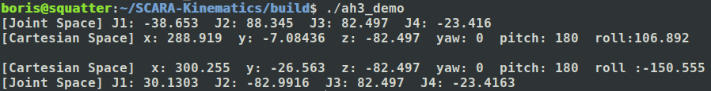
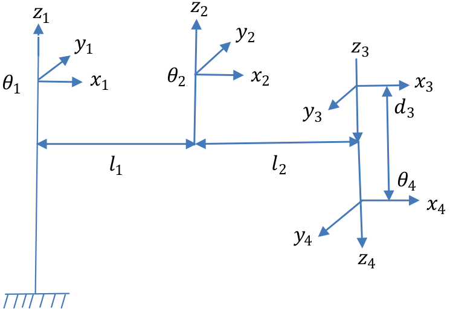
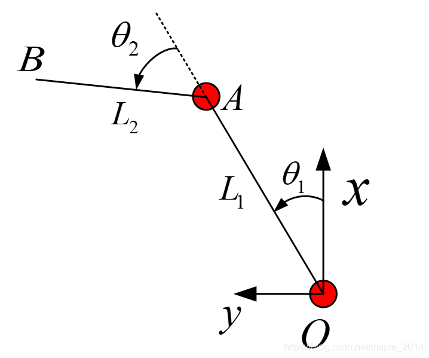
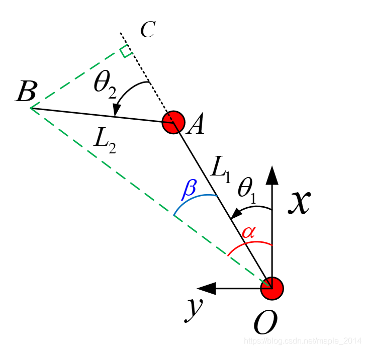

#  SCARA-Kinematics
SCARA机器人运动学正逆解算法C++实现
### 1. Prerequisites
#### Linux
> - CMake (>=2.8.3)
> - C++ compiler (e.g., g++ or Clang)

### 2. Build
#### Linux
```shell
git clone https://github.com/woodphayt/SCARA-Kinematics
cd SCARA-Kinematics && mkdir build && cd build
cmake ..
make
./ah3_demo
```

### 3. Result


### 4. Algorithms

#### 4.1. 机器人空间模型


#### 4.2. SCARA机器人运动学正解
<br>
末端*B*的*x*坐标为向量*OA*与向量*AB*在*x*轴上投影之和，末端*B*的*y*坐标亦然：<br>
 &nbsp;&nbsp;&nbsp;&nbsp;&nbsp;&nbsp; (1)<br>


第三轴为丝杆上下平移运动，令平移距离为，则末端*B*的*z*坐标：<br>
&nbsp;&nbsp;&nbsp;&nbsp;&nbsp;&nbsp; (2)<br>

末端*B*的姿态角*roll*：<br>
&nbsp;&nbsp;&nbsp;&nbsp;&nbsp;&nbsp; (3)<br>


综上，SCARA机器人的运动学正解为：<br>
&nbsp;&nbsp;&nbsp;&nbsp;&nbsp;&nbsp; (4)<br>

#### 4.3. SCARA机器人运动学逆解
<br>
连接*OB*，过*B*作*BC*垂直于*OA*于*C*，在中，由余弦定理：<br>

&nbsp;&nbsp;&nbsp;&nbsp;&nbsp;&nbsp; (5)<br>

式(5)可写成：<br>
&nbsp;&nbsp;&nbsp;&nbsp;&nbsp;&nbsp; (6)<br>

又有：<br>
&nbsp;&nbsp;&nbsp;&nbsp;&nbsp;&nbsp; (7)<br>

取正数解，机器人处于右手系；取负数解，机器人处于左手系；特殊地，若，机器人处于奇异位置，此时

至此，可求得:<br>
&nbsp;&nbsp;&nbsp;&nbsp;&nbsp;&nbsp; (8)<br>

如上图，易得：<br>
&nbsp;&nbsp;&nbsp;&nbsp;&nbsp;&nbsp; (9)<br>

在中，记：<br>
&nbsp;&nbsp;&nbsp;&nbsp;&nbsp;&nbsp; (10)<br>
&nbsp;&nbsp;&nbsp;&nbsp;&nbsp;&nbsp; (11)<br>

由于*r>0*，由式(10)和式(11)得：<br>
&nbsp;&nbsp;&nbsp;&nbsp;&nbsp;&nbsp; (12)<br>

至此，可求得：<br>
&nbsp;&nbsp;&nbsp;&nbsp;&nbsp;&nbsp; (13)<br>

由式(4)容易求得和。
综上，SCARA机器人的运动学逆解为：<br>
&nbsp;&nbsp;&nbsp;&nbsp;&nbsp;&nbsp; (14)<br>

### 5. References
- [1] [SCARA机器人运动学正逆解](https://blog.csdn.net/maple_2014/article/details/104596998)
- [2] [绘制SCARA机器人工作空间](https://blog.csdn.net/maple_2014/article/details/104932733)
- [3] [为什么机器人运动学逆解最好采用双变量反正切函数atan2而不用反正/余弦函数？](https://blog.csdn.net/maple_2014/article/details/104594261)